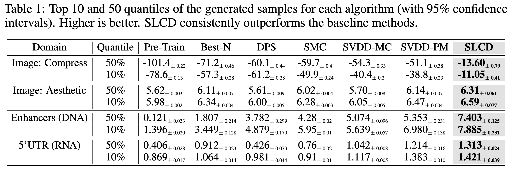

# Code for *Efficient Controllable Diffusion via Optimal Classifier Guidance*

This code accompanies our paper [Efficient Controllable Diffusion via Optimal Classifier Guidance](https://example.com) where the goal is to maximize the reward of generated samples from a diffusion model. Our method Supervised Learning based Controlled Diffusion (SLCD) is a simple yet effective method that can be used to control the generation of diffusion models. We further demonstrate superior performance on image and molecule sequence generation tasks.



There are two main experiments in the paper: image generation tasks and molecule sequence generation tasks. The code for the image generation tasks is in the `image_generation/` folder, and the code for the molecule sequence generation tasks is in the `molecule_sequence_generation/` folder. Each folder contains the code and readme for setting up the corresponding environment.


## Reference
If you find this work useful, please consider citing:

```bibtex
@misc{oertell2025efficient,
      title={Efficient Controllable Diffusion via Optimal Classifier Guidance}, 
      author={Owen Oertell and Shikun Sun and Yiding Chen and Jin Peng Zhou and Zhiyong Wang and Wen Sun},
      year={2025},
      eprint={2505.21666},
      archivePrefix={arXiv},
      primaryClass={cs.LG},
      url={https://arxiv.org/abs/2505.21666}, 
}```
